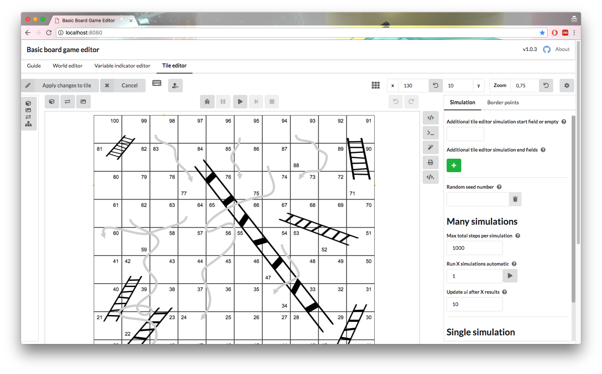

# basic board game editor

is a basic board game editor with some simulation capabilities (and printing)

[Demo](https://janisdd.github.io/basic-board-game-editor/)



## usage

open the file `dist/index.html` in your preferred browser

(after you downloaded/cloned the project or just the dist folder)


## setup

if you want to run the dev server for development or the tests you need to

```bash
cd /to/the/project/dir
npm install
```

## running the dev server

```bash
npm run dev
# then open your browser at http://localhost:8080
```

*on mac you might get high cpu usage even if you are not modifying anything...*
*according to https://github.com/webpack/webpack/issues/701 you need to install `npm install fsevents` to solve this*

## building

if you're on linux/mac and you got `sed` & `echo` then you can just run

```bash
npm run buildCompiler # this will build the interpreter (it's actually not a compiler but like to call is so)
npm run build         # this will build & output into ./dist
```

if you don't have `sed` & `echo` then you need to take some manual steps to build the compiler (actually just delete some lines in some file)

see `devDocs/usingTheInterpreter.md` for these steps

## running tests

tests are only done for the interpreter and are written in jest

```bash
npm run test
```

there are still some tests missing.
the tests can be found at `simulation/__tests__`

## dev docs

the dev docs are located at `./devDocs`

## notes

there won't be much movement in this project (at least from me)
because i have some other things/projects to do and for my *board game* all features are there

## TODOs & issues

in `./TODO.md` are issues, ideas & todos captured

some of the notable issues are


- when a line is connected to a field anchor point then moving the field/line undo is bugged
	- this could also mess up the field connected lines list

- when a line is connected (through an anchor point) to a field symbol instance and we change the width/height of the symbol
  - then the line is still connected to the field but is not moved!

- printing (vars) maybe not all vars are found

- variable check maybe not all vars are found

- when the tile outline is displayed the drag operations (fields/lines/imgs) are slow

- error messages are not i18n ready